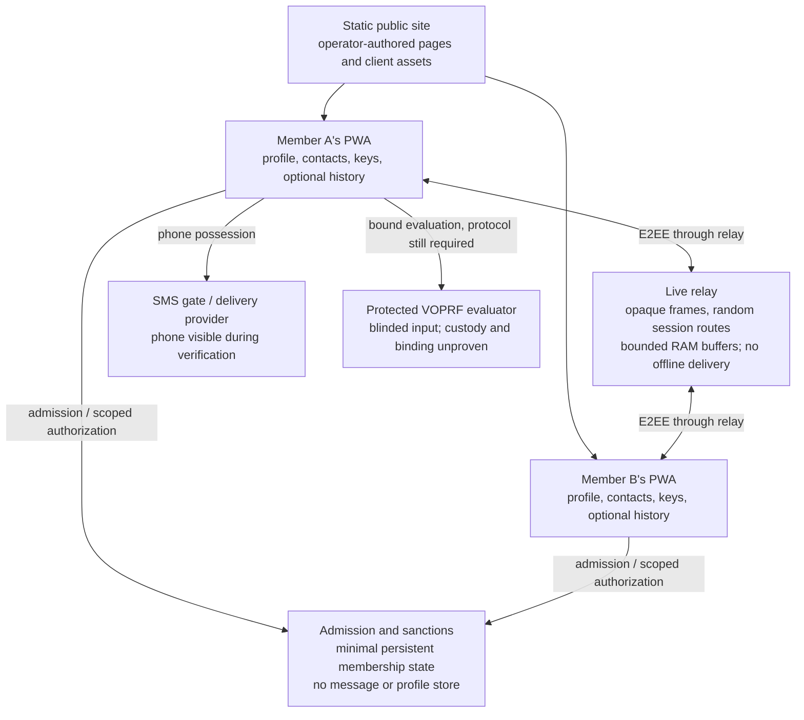

# End-to-end architecture

Reviewed 8 September 2026. **Design proposal, not deployed.** The user has asked
to act as a relay and retain little data, with no operator content moderation.
This supersedes the unconditional public-board-first build order. Live-only
discovery is the proposed trade-off; the user's preference is still pending.
The old board is an archived alternative, not a launch dependency.

Read the [relay study](../studies/relay-architecture-2026-09-08.md),
[data lifecycle](data-lifecycle.md), [security gates](security-review.md),
[decisions](decisions.md) and [next steps](next.md). `core/` is a trusted simulation;
its 68 existing tests establish neither E2EE nor anonymous membership.

## Service shape

These are trust boundaries, not a claim that separate processes hide information
from a common operator. Issuance and relay access must not carry a shared stable
identifier. Correlation by timing or IP requires more than separate databases;
anonymous authorization and observer privacy remain release gates.

| Part | Responsibility | Retention boundary |
|---|---|---|
| `app/` | Profiles, local preferences, contacts, invitations, E2EE, local blocks and optional encrypted history | Member-controlled devices and exports |
| `relay/` | Forward opaque frames to recipients selected by members while connected | Live route/socket map and bounded transport buffers only |
| Admission, specified with `anchor/` and protocol docs | Membership, invite budgets, composition, revocation, phone uniqueness and burns | Small persistent security ledger; production schema still to prove |
| `board/` | Previous public plaintext ad-board proposal | Archived; no operator-hosted member content in this candidate |
| `deploy/` | Static site, configuration evidence, releases, provider inventory and lawful request handling | Operator material; no member identifiers in routine telemetry |
| `core/` | Executable model of membership and enforcement rules | Simulation holds client secrets and extra metadata; never deploy `Network` |

## How members meet

1. A member creates a profile on their device. Display names are local contact
   labels, not a server-reserved namespace. No profile upload, public ad index,
   sensitive-attribute search endpoint or offline presence record is required.
2. Members exchange capability invitations or introduce each other in a live,
   closed session. A room host selects/invites participants; the relay does not
   rank people or choose matches. Keep invitation secrets out of URL paths,
   query strings, access logs and third-party analytics.
3. Both clients authenticate the session and exchange the profile fields they
   choose. Recipients can keep copies; the operator cannot guarantee deletion
   from their devices.
4. Chat uses that same messenger. Closed groups remain 3–8 with existing creator
   surety and member-triggered closure/slashing rules. Membership changes require
   authenticated rekeying before further messages, alongside periodic rekeying.
5. On disconnect the live route disappears. There is no profile replay, unread
   inbox, last-seen timestamp or retained push subscription to wake the member.

**Newcomer access stays.** Phone-only admission is not replaced with vouch-only
entry. A newcomer still needs an introduction: for example a member-hosted
session advertised through that member's existing community channel. General
opening hours can be operator-authored public information. Neither guarantees
that a welcoming member will be online. Test this cold-start problem; do not
quietly restore the public board or make the operator host introductions.

Live discovery sacrifices browsing offline profiles. If that is essential,
someone must retain a discoverable copy: the member's always-on device, another
chosen host, or this service. Encryption alone does not resolve who can discover
and decrypt it. A common key given to every registrant is not a private recipient
boundary. See D11.

## Live transport contract

- Clients encrypt before transmission; TLS alone is insufficient. The relay gets
  neither content keys nor readable profile, message or media fields.
- Route by fresh random session handles. Keep stable credentials, human names,
  phone anchors and durable room identifiers out of the transport API.
- Forward only while the selected recipient is connected. Bound backpressure by
  bytes and time; drop undelivered frames for slow/disconnected recipients.
  No offline queue does not mean zero network buffering.
- Disconnect, idle timeout, expiry, crash and restart leave no replayable session
  in application storage. Cleanup must not depend on the whole process dying.
- No relay database, object store, hibernation attachment or disk spool. Audit
  reverse proxies, swap, crash dumps, tracing and backups; managed infrastructure
  may not expose control over every layer.
- IPs, socket relationships, traffic sizes and timing remain observable during
  service. RAM-only operation proves neither secure erasure nor protection from
  live compromise, endpoint recording or provider activity records.

The [lifecycle table](data-lifecycle.md) specifies proposed limits and checks.
There is no production relay or effective deployed configuration yet.

## Persistent enforcement cannot be wished away

Keep the decided vouching/slashing, 50:50 issuance policy, phone-only admission,
invite limits and reciprocity rules as requirements. They need state that survives
a dishonest client's reset. Local-only balances would let that client erase a
deficit; forgetting spent tokens permits replay.

Separate admission/enforcement from transport. Candidate mechanisms include
anonymous credentials, scoped one-use quota tokens, revocation proofs and
bounded spent-token sets. These need reviewed protocol work. Proving earned
interaction credit without retaining participants or accepting collusive fake
sessions is unresolved. Do not deploy the current per-member balance map as an
anonymous substitute, or delete enforcement semantics to make an inventory empty.

Anchors, capsules and nullifiers are pseudonymous security data, not valueless
bytes. Threshold opening deliberately reveals some associations. Ordinary
passkey authentication also stores public credential records unless a verified
alternative uses passkeys only on-device. Login must not silently become a stable
relay identity. Include all these items in the inventory.

The SMS gate/provider sees a phone number to send a code. A separate VOPRF
evaluator can see only blinded input, but verified-phone-to-input binding and
independent custody remain unsolved here. Not every server is blind to the number.

## Hosting and claims

Cloudflare Workers/Durable Objects is a candidate, not an assumed production
relay. Historical per-object metrics conflict with a promise of no room-activity
records. Compare a runtime with control over logging, swap, dumps and backups;
inventory its host's own records before selecting it. Self-hosting or changing
vendor alone proves nothing about provider retention. Evidence is in the
[study](../studies/relay-architecture-2026-09-08.md); the choice remains D8.

Open source, reproducible client artifacts and served-build verification make
intended behaviour inspectable. They do not prove that a live server never logs
or every visitor received that build. No claim of nothing to disclose, no social
graph ever visible, or no legal duties follows.

The target is **no operator-held private plaintext or content keys, no application
message/profile storage, and narrowly specified security state**. The user's
no-content-moderation requirement stays hard. Classification of the final
relay/admission service remains D10; its name does not settle it.

## Implementation order

1. Resolve live versus offline discovery with a concrete flow; compare provider
   retention boundaries before choosing transport hosting.
2. Specify every enforcement/authentication record and expiry, then prove
   anonymous authorization, quota, capsule-release and SMS-binding boundaries.
3. Verify existing VOPRF custody and real-device PRF gates. No new spending,
   hosted experiment or release is authorized by this document alone.
4. Build a synthetic two-client relay slice with disconnect/backpressure/restart
   checks. Measure concurrency without retaining member activity histories.
5. Add authenticated groups, local profile exchange and member introductions;
   validate newcomer usefulness without a retained profile catalogue.
6. Publish supportable claims after provider, deployment, client and service
   classification reviews. Keep the private-repository release rules.
